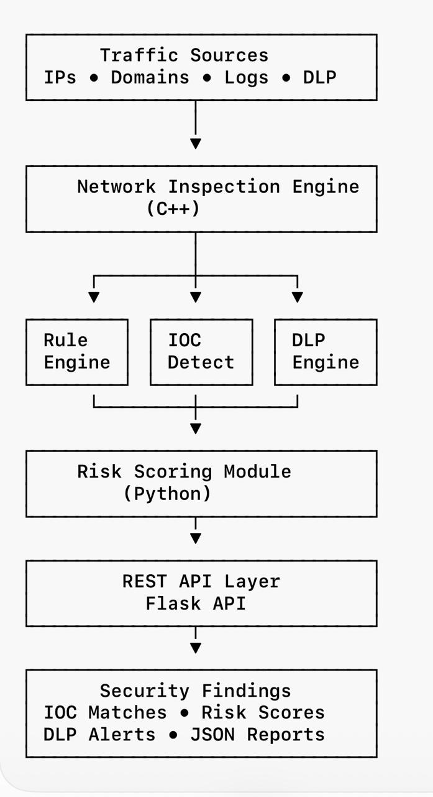

# Secure Network Inspection Platform

Security-focused traffic inspection platform built in C++ and Python for IOC detection, DLP inspection, threat scoring, and REST API integration.

## Quick Summary

A security-focused network inspection platform built in C++ and Python that performs:

- IOC Detection (Indicators of Compromise)
- Data Loss Prevention (DLP) Inspection
- Risk-Based Threat Scoring
- Malicious IP and Domain Detection
- Rule-Based Traffic Analysis
- REST API Integration
- JSON Report Generation

## Architecture

## Key Capabilities

- IOC (Indicator of Compromise) Detection
- Malicious Domain Identification
- Malicious IP Detection
- DLP Inspection
- Risk Scoring
- REST API Integration
- JSON Report Generation

## Technology Stack

- C++
- Python
- Linux
- REST APIs

## Project Structure

- `src/`  - Core inspection engine
- `api/`  - REST API layer
- `ai/`   - Risk scoring module
- `data/` - IOC and traffic datasets

## Sample Detection Categories

- Malicious IP detection
- Malicious domain detection
- Data exfiltration indicators
- Suspicious traffic patterns

## Future Enhancements

- Real-time packet capture
- Threat intelligence integration
- SIEM integration
- Dashboard visualization
- Machine learning anomaly detection

## Disclaimer

This project was created for learning and portfolio purposes and does not contain proprietary code from any employer.
